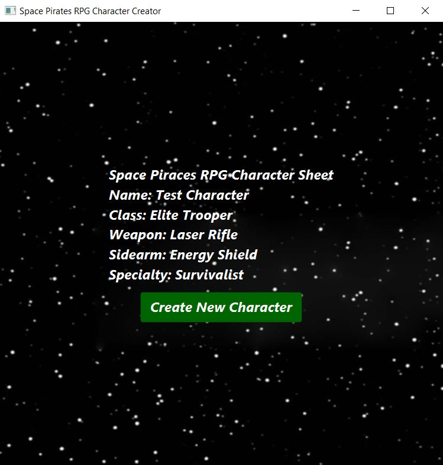

# Java-II-2023-Project
This is the Final Project of my Java II class that I took my final semester at college in the Spring of 2023.

## Short Description
I worked with a classmate to build a simple JavaFx From app for a fictional Space Pirates RPG game that that allows the user to create a simple character sheet.

### Example Images Of the JavaFx Application
**Start Window**

**Form Window**

**Final Window**

